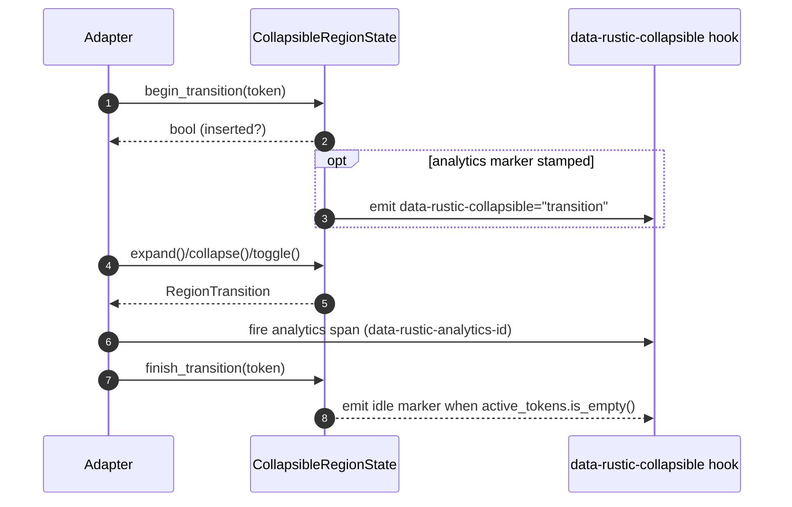
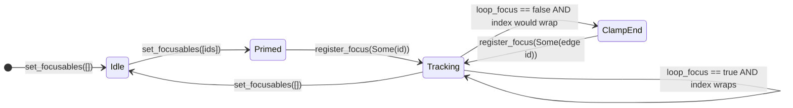

# Headless State Machines: Collapsible Regions & Focus Traps

> Status: Adopted in `rustic-ui-headless` and surfaced by all framework adapters

The `rustic-ui-headless` crate consolidates disclosure and overlay control into
explicit state machines so enterprise teams can script transitions, analytics
hooks, and automation metadata exactly once. This guide expands on the inline
Rust documentation for [`CollapsibleRegionState`](../../crates/rustic-ui-headless/src/collapsible_region.rs)
and [`FocusTrapState`](../../crates/rustic-ui-headless/src/focus_trap.rs),
walking through their transition tables, token lifecycles, and focus-loop
contracts. Automation-friendly `data-rustic-*` attributes and analytics markers
are called out throughout because they feed our telemetry exporters, QA bots,
and scripted smoke tests.

## Collapsible Region State Machine

Collapsible regions back accordions, FAQ lists, and disclosure widgets. The
state machine separates controlled and uncontrolled flows so integrations can
avoid race conditions while still emitting deterministic automation IDs such as
`data-rustic-collapsible` and analytics tags via
`CollapsibleTriggerAttributes::analytics_id`.

```mermaid
%% Controlled vs. uncontrolled transitions for CollapsibleRegionState
%% Keep state names aligned with RegionTransition to simplify doc sync scripts.
stateDiagram-v2
    direction LR
    %% Uncontrolled regions mutate internal state immediately.
    state "Uncontrolled" as Uncontrolled {
        [*] --> Collapsed_U : initialize(default_expanded=false)
        Collapsed_U --> Expanded_U : expand()/toggle()
        Expanded_U --> Collapsed_U : collapse()/toggle()
    }
    %% Controlled regions notify first and await sync() from the adapter.
    state "Controlled" as Controlled {
        [*] --> Collapsed_C : initialize()
        Collapsed_C --> NotifyExpand : expand()/toggle()
        NotifyExpand --> Collapsed_C : sync(false)
        NotifyExpand --> Expanded_C : sync(true)
        Expanded_C --> NotifyCollapse : collapse()/toggle()
        NotifyCollapse --> Expanded_C : sync(true)
        NotifyCollapse --> Collapsed_C : sync(false)
    }
    %% External caller decides which control strategy to adopt.
    [*] --> Uncontrolled : CollapsibleRegionState::uncontrolled()
    [*] --> Controlled : CollapsibleRegionState::controlled()
```

### Token lifecycle orchestration

Transition tokens guarantee that concurrent animations (CSS height changes,
opacity fades, analytics beacons) complete before the region claims it is idle.
Adapters should pass the same token to both `begin_transition` and
`finish_transition` to keep automation logs reproducible.



### Automation checklist

- **Automation hooks** – Every trigger/region descriptor exposes
  `data-rustic-collapsible` values so CI scripts can assert SSR vs. hydration
  parity without brittle CSS selectors.
- **Analytics markers** – Use
  `CollapsibleTriggerAttributes::analytics_attribute` and
  `CollapsibleContentAttributes::analytics_attribute` to stamp
  `data-rustic-analytics-id` onto both surfaces. The shared naming convention
  keeps dashboards in sync across adapters.
- **Focus return** – When collapsing regions with keyboard focus, populate
  `set_focus_return` so adapters can re-focus the trigger, preserving tab order
  for accessibility audits.

## Focus Trap State Machine

`FocusTrapState` coordinates overlay focus boundaries. It mirrors dialog modal
state, manages sentinel nodes that output `data-rustic-focus-trap`, and
propagates analytics identifiers via `FocusTrapSentinelAttributes` so telemetry
pipelines can trace user journeys through trapped surfaces.



### Sentinel emission map

The sentinel helpers expose deterministic attributes so adapters can wire up
focus-loop DOM nodes and global analytics.

```mermaid
%% Attribute emission table expressed via Mermaid graph for quick scanning.
graph TD
    %% Keep node IDs in sync with FocusTrapSentinelAttributes accessors.
    Trap[FocusTrapState]
    SentinelStart[Start Sentinel]
    SentinelEnd[End Sentinel]
    Trap -- set_analytics_tag(Some(tag)) --> Trap
    Trap -- start_sentinel_attributes() --> SentinelStart
    Trap -- end_sentinel_attributes() --> SentinelEnd
    SentinelStart -- data-rustic-focus-trap="sentinel-start" --> DOMStart
    SentinelEnd -- data-rustic-focus-trap="sentinel-end" --> DOMEnd
    SentinelStart -- data-rustic-analytics-id --> Analytics
    SentinelEnd -- data-rustic-analytics-id --> Analytics
    %% DOM nodes feed automation harnesses that assert focus loop contracts.
    DOMStart --> AutomationHarness
    DOMEnd --> AutomationHarness
```

### Focus-loop automation notes

- **Looping vs. clamped traps** – `loop_focus()` returning `true` signals adapters
  to retain sentinel listeners that wrap focus. When `false`, the automation
  harness still inspects `data-rustic-focus-trap` markers to ensure the trap
  releases focus at the extremes.
- **Analytics propagation** – Store a telemetry tag with
  `set_analytics_tag(Some("dialog"))` (or any namespaced value) so both sentinels
  share the same `data-rustic-analytics-id` and dashboards can stitch the
  session.
- **Control key analytics** – Each call to `handle_key` should be accompanied by
  instrumentation that records the `ControlKey` and resulting
  `FocusDisposition`. Surface those spans alongside the sentinel attributes so
  replay tools can connect the user input to DOM focus changes.

## Regression guardrails

To prevent diagram or doc bit rot:

- **`cargo xtask docs-build`** now parses every ` ```mermaid ` block under
  `docs/` before compiling the Rust + WASM bundles. The Rust validator covers
  the state, sequence, and graph grammars we publish in this note so syntax
  regressions fail fast without depending on headless browser tooling.
- **`cargo test -p rustic-ui-headless --test focus_trap_state`** keeps focus-loop
  invariants covered, complementing the visual diagrams with executable
  regression tests.
- **`cargo test -p rustic-ui-headless --test collapsible_region_state`** (add
  similar coverage when extending the module) should validate token lifecycles
  and automation markers whenever new attributes ship.
